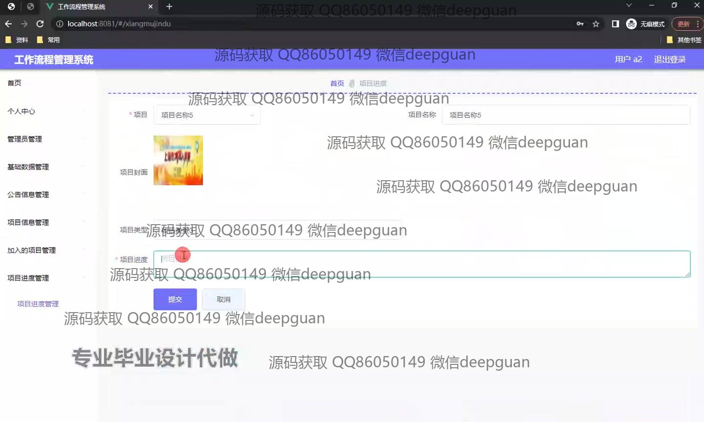
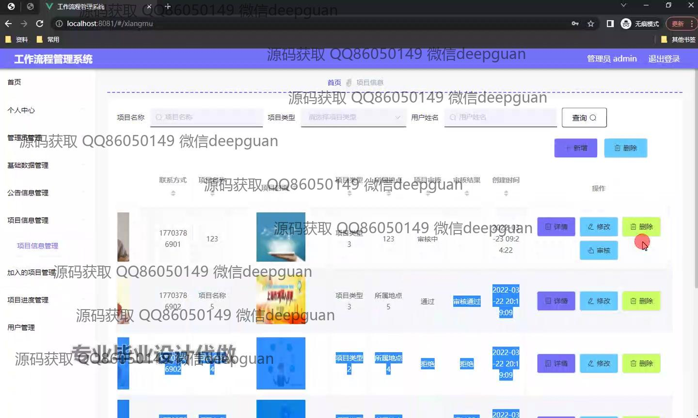

<h1 align="center">基于框架的工作流程管理系统的设计与实现</h1>

## 简介
Spring Boot工作流程管理系统：角色分为管理员、用户；功能包括项目管理、公告信息管理、项目进度跟踪、审批管理、基础数据管理，界面简洁直观，支持分页和搜索功能，提高企业协作效率。    --计算机毕业设计源码；毕设源码；java毕业设计源码

## 联系方式

<h3 align="center">获取完整代码与数据库文件 + 微信：deepguan QQ: 86050149 QQ群: 783742310</h3>

<h3 align="center">可帮忙远程部署 包运行成功！提供远程部署、修改代码、设计文档指导、代码讲解等服务！</h3>

## 功能介绍（完整见运行截图）
管理员： 管理员可以访问系统中的管理中心，进行用户权限管理、项目审批和流程设计等功能。其主要职责包括管理用户信息，审核和批准项目及任务，确保系统运行的稳定性和安全性。此外，管理员还具备对基础数据、公告信息以及项目进度进行管理和修改的权限。可以通过搜索和筛选功能高效查找相关信息，查看发布和审批记录。

用户： 用户通过个人中心可以查看和修改个人信息，管理自己的项目进度及参与的项目组详情。具备搜索与筛选特定项目的功能，能查看加入项目的进度和详情，申请项目加入或查看管理层发布的公告信息。用户还可以使用项目列表功能，通过上传项目封面和设定项目类型，来对项目编辑和进度跟踪。通过简单明了的导航结构，用户能够便捷地管理自己的任务和协作内容。

## 运行截图

本代码来源于网络,仅供学习参考使用!

